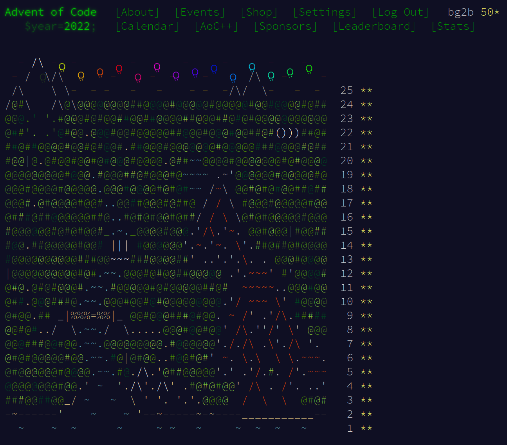

# Advent of Code 2022

Info and problems are available at https://adventofcode.com/2022

Each day's problem input and solution is in a subdirectory, `01`, `02`, etc.

Solutions are C++.  Compile with:
```
g++ -std=c++17 -Wall -g -o doit doit.cc
```

Input has sometimes been pre-processed for ease of reading.
Example input if any is called `input1`.
The real input is `input`.

Input is on stdin, output is printed to stdout.  Run part 1 as `./doit
1 < input` and part 2 as `./doit 2 < input`

Sometimes I might go back and revisit a problem in a different
(usually more efficient) way.  Alternatives will be other `.cc` files
starting with `doit`.


